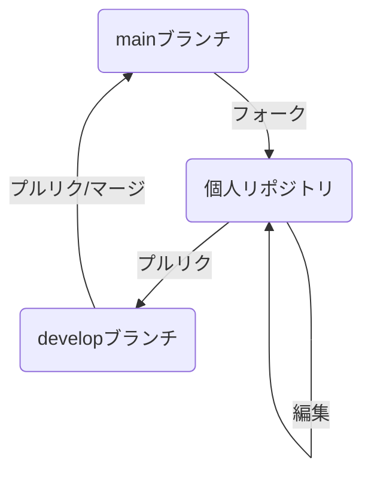

# memo:Re
味噌展プロジェクト

## GitHub上の作業フローチャート

```mermaid
%%{init:{'theme':'default'}}%%
graph TD

	mainブランチ(mainブランチ) --> |フォーク|個人リポジトリ
	developブランチ(developブランチ) --> |プルリク/マージ|mainブランチ
	個人リポジトリ(個人リポジトリ) --> |プルリク|developブランチ
	個人リポジトリ --> |編集|個人リポジトリ
```