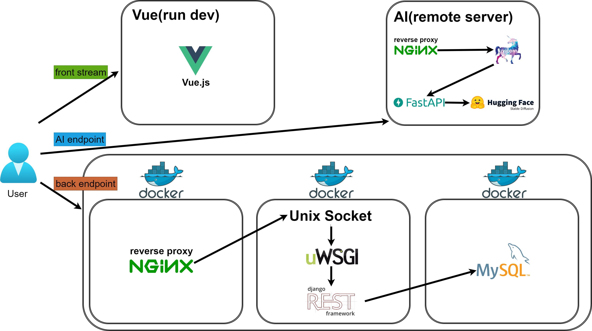
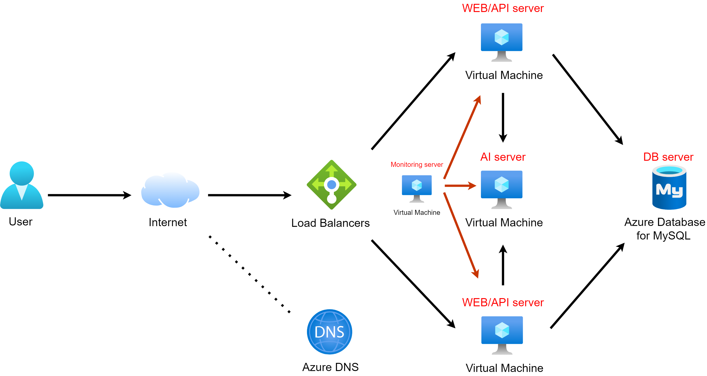
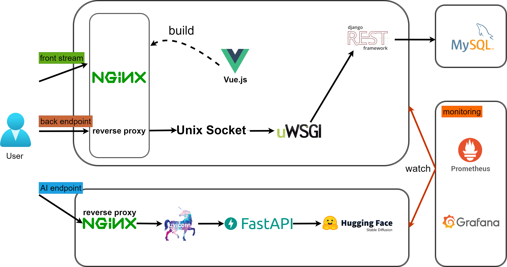

# memo:Re

## ダウンロード

```sh
git clone https://github.com/Kazumasa1/memo-re.git
```

## envの設定
”.env.sample" と同じ階層に ".env" を作成してコードを書き加えてください。
”config.js.sample" と同じ階層に "config.js" を作成してコードを書き加えてください。

## 使い方

### Dockerの起動（バック、DB）

次のコマンドを実行してDocker コンテナを構築します。

```bash
cd memo-re
docker compose build --no-cache
docker compose up -d
```

### Vueの起動（フロント）

```bash
cd memo-re/web/app
npm ci
npm run serve
```

### AIサーバの起動（AI）

```bash
```

## 動作環境

### バック

Nginx(Django): http://localhost:8000/

Nginx(Django)管理者サイト: http://localhost:8000/${DJANGO_ADMIN_URL}
 - メールアドレス: ${DJANGO_ADMIN_EMAIL}
 - パスワード: ${DJANGO_ADMIN_PASSWORD}

Nginx(Django)APIドキュメントダウンロード: http://localhost:8000/api/schema/

Nginx(Django)APIドキュメント:swaggerUIで閲覧およびテスト http://localhost:8000/api/schema/swagger-ui/

Nginx(Django)APIドキュメント:redocで閲覧およびテスト http://localhost:8000/api/schema/redoc/

### フロント
Vue.js: http://localhost:8080/

### ディレクトリ構成

```sh
memo-re
├── README.md
├── back
│   ├── Dockerfile
│   ├── app			# Djangoのプロジェクト
│   ├── requirements.txt
│   ├── start.sh	# docker-compose up で実行される Django起動シェル
│   └── templates
├── db
│   ├── Dockerfile
│   └── my.cnf
├── docker-compose.yml
└── web
    ├── Dockerfile
    ├── app			# Vueのプロジェクト
    ├── conf
    ├── logs
    └── uwsgi_params
```
### ローカル図



### ネットワーク図



### システム構成図



## 作者

- [@Kazumasa1](https://github.com/Kazumasa1)
- [@KleinChiu](https://github.com/KleinChiu)
- [@SoraUno](https://github.com/SoraUno)
- [@Yuuma-ujimoto](https://github.com/Yuuma-ujimoto)
- [@honjii](https://github.com/honjii)
- [@mi1207](https://github.com/mi1207)
- [@nagi-lc3](https://github.com/nagi-lc3)
- [@reone19](https://github.com/reone19)
- [@sean-dp](https://github.com/sean-dp)

---

<div align="center">
    
    <p style="font-weight: bold">memo:Re</p>
</div>
